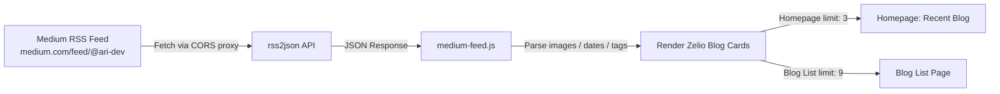

# Medium Integration Implementation Plan

Integrasi ini menghubungkan Medium RSS Feed ke portofolio Zelio (static HTML + Gulp) secara real-time, tanpa backend. Blog cards di homepage dan halaman blog list otomatis menampilkan artikel terbaru dari Medium begitu halaman dibuka.

> **Status: ✅ SELESAI DIIMPLEMENTASI**

---

## Architecture & Workflow



### 1. Data Fetching Strategy
- **Endpoint:** `https://api.rss2json.com/v1/api.json?rss_url=https://medium.com/feed/@ari-dev&count=<limit>`
- **Username:** `@ari-dev` → `https://medium.com/@ari-dev`
- **No Backend Required:** 100% static hosting compatible (GitHub Pages, Netlify, Vercel, static server).
- **Auto-Sync:** Setiap artikel baru di Medium langsung tampil di portfolio tanpa perlu rebuild atau redeploy.
- **API Limit:** rss2json free tier max 10 item/request — limit 9 di blog list sudah aman.

### 2. Post Processing & Parsing
- **Thumbnail:** Prioritas `item.thumbnail` → fallback extract `` pertama dari `content` → fallback ke gambar lokal `assets/imgs/blog/blog-1/img-*.png` (12 gambar tersedia, cycling by index).
- **Categories/Tags:** Ambil `item.categories[0]`, default `"Article"` jika kosong.
- **Read Time & Date:** Format tanggal ke `Mon DD, YYYY` + estimasi baca (~200 kata/menit dari word count stripped HTML).
- **Description:** Strip HTML tags dari `item.description`, truncate ke 110 karakter dengan `...`.

### 3. UI/UX States
- **Loading State:** Skeleton animated placeholder (3 atau 9 card) dengan `@keyframes medium-pulse` pulse animation — style di-inject sekali ke `<head>` lewat JS.
- **Success State:** Cards di-render pakai HTML string yang identik dengan struktur `blog-card.html` (class-nya sama persis: `blog-card`, `blog-card__image`, `blog-card__link`, `blog-card__content`, dll.) sehingga CSS di `_customize.scss` berlaku otomatis tanpa perubahan.
- **Error / Offline Fallback:** Tampil pesan "Could not load articles right now." + tombol "Read on Medium" yang link ke `https://medium.com/@ari-dev`.
- **Image Error:** Tiap `` punya `onerror` handler yang fallback ke gambar lokal cycling.

---

## Changes Implemented

### [NEW] [medium-feed.js](file:///d:/JASA%20WEBSITE/personal/zelio-personal-portfolio-html-bootstrap-template-2024-10-16-03-52-55-utc/Zelio_v3.0.0_Unzip-First/2.Zelio_Development_SourceCode/src/assets/js/medium-feed.js)

File baru di `src/assets/js/medium-feed.js` — otomatis ter-copy ke `dist/assets/js/` oleh Gulp `copyAssets` task.

Modul vanilla JS (IIFE, tidak bergantung jQuery), structure:

```
CONFIG           → username, homeLimit, listLimit, apiBase, fallbackImages[]
extractImageFromContent() → regex extract  src dari HTML string
getThumbnail()   → thumbnail → content img → fallback cycling
getTag()         → categories[0] atau "Article"
formatDate()     → "Aug 27, 2025 • 3 min read"
buildDescription() → strip HTML + truncate 110 chars
renderSkeletons() → inject skeleton HTML + @keyframes style ke <head>
renderCard()     → HTML string identik struktur blog-card.html
renderError()    → fallback error state dengan link ke Medium
escapeHtml()     → XSS protection untuk text content
escapeAttr()     → XSS protection untuk atribut HTML
fetchFeed()      → fetch() ke rss2json API, error handling
initHomeBlog()   → init untuk #medium-recent-blog (limit: 3)
initBlogList()   → init untuk #medium-blog-list (limit: 9)
Bootstrap        → document.addEventListener('DOMContentLoaded', ...)
```

---

### [MODIFY] [scripts.html](file:///d:/JASA%20WEBSITE/personal/zelio-personal-portfolio-html-bootstrap-template-2024-10-16-03-52-55-utc/Zelio_v3.0.0_Unzip-First/2.Zelio_Development_SourceCode/src/views/partials/scripts.html)

Ditambahkan 1 baris setelah `main.js`:

```html
<!-- Medium RSS Feed Integration -->
<script src="assets/js/medium-feed.js"></script>
```

Shared partial — berlaku otomatis untuk semua halaman yang include `scripts.html`.

---

### [MODIFY] [blog-1.html](file:///d:/JASA%20WEBSITE/personal/zelio-personal-portfolio-html-bootstrap-template-2024-10-16-03-52-55-utc/Zelio_v3.0.0_Unzip-First/2.Zelio_Development_SourceCode/src/views/sections/blog/blog-1.html)

Blok `@@loop('blog-card.html', [...])` statis diganti dengan dynamic container:

```html
<!-- medium-feed.js dynamically renders cards into this container -->
<div class="row mt-8" id="medium-recent-blog">
    <!-- Cards injected by medium-feed.js (limit: 3) -->
</div>
```

Semua bagian lain (section wrapper, header "Recent blog", tombol "View more" ke `blog-list.html`) **tidak diubah**.

---

### [MODIFY] [blog-list.html (section)](file:///d:/JASA%20WEBSITE/personal/zelio-personal-portfolio-html-bootstrap-template-2024-10-16-03-52-55-utc/Zelio_v3.0.0_Unzip-First/2.Zelio_Development_SourceCode/src/views/sections/blog/blog-list.html)

Blok `@@loop('blog-card.html', [...])` statis diganti dengan dynamic container:

```html
<!-- medium-feed.js dynamically renders cards into this container -->
<div class="row mt-8" id="medium-blog-list">
    <!-- Cards injected by medium-feed.js (limit: 9) -->
</div>
```

Semua bagian lain (section wrapper, header teks) **tidak diubah**.

---

### [MODIFY] [blog-list.html (page)](file:///d:/JASA%20WEBSITE/personal/zelio-personal-portfolio-html-bootstrap-template-2024-10-16-03-52-55-utc/Zelio_v3.0.0_Unzip-First/2.Zelio_Development_SourceCode/src/views/pages/blog-list.html)

Include pagination di-comment out (tidak dihapus, mudah di-uncomment jika butuh):

```html
<!-- Pagination disabled: Medium RSS feed does not require static pagination -->
<!-- @@include("../partials/pagination.html") -->
```

---

## Files NOT Modified (Already Ready)

| File | Alasan |
|------|--------|
| `blog-card.html` | Template statis Gulp — tidak relevan untuk JS dynamic rendering |
| `blog-card-page-2.html` | Tidak digunakan di scope halaman ini |
| `blog-1-page-2.html` | Halaman lain, di luar scope |
| `_customize.scss` | CSS `.blog-card`, `.section-blog-1`, `.section-blog-list` sudah lengkap |
| `main.js` | Tidak perlu dimodifikasi |
| `gulpfile.js` | Build pipeline sudah otomatis copy `src/assets/js/**/*` ke `dist/` |
| `pagination.html` | Dipertahankan, hanya include-nya yang di-comment |
| `index.html` (page) | Tidak perlu diubah |

---

## Verification Results

### Build Check
```
npm run build → exit code 0, no errors
```

### Dist Output Confirmed
- `dist/index.html` line 1085: `<div class="row mt-8" id="medium-recent-blog">`
- `dist/index.html` line 1257: `<script src="assets/js/medium-feed.js"></script>`
- `dist/blog-list.html` line 241: `<div class="row mt-8" id="medium-blog-list">`
- `dist/blog-list.html` line 247: pagination comment ada
- `dist/blog-list.html` line 469: `<script src="assets/js/medium-feed.js"></script>`
- `dist/assets/js/medium-feed.js` → **True** (file ter-copy oleh Gulp)

### Manual Browser Verification (Langkah User)
1. Jalankan `npm run dev` → browser otomatis terbuka
2. **Homepage** → scroll ke "Recent Blog" → pastikan 3 artikel dari `medium.com/@ari-dev` muncul
3. **Blog List page** → pastikan 9 artikel muncul, pagination tidak terlihat
4. **Klik card** → artikel terbuka di tab baru (Medium)
5. **Toggle Dark/Light mode** → card tetap tampil dengan baik
6. **Offline test** → DevTools → Network → Offline → refresh → muncul pesan fallback + tombol "Read on Medium"
